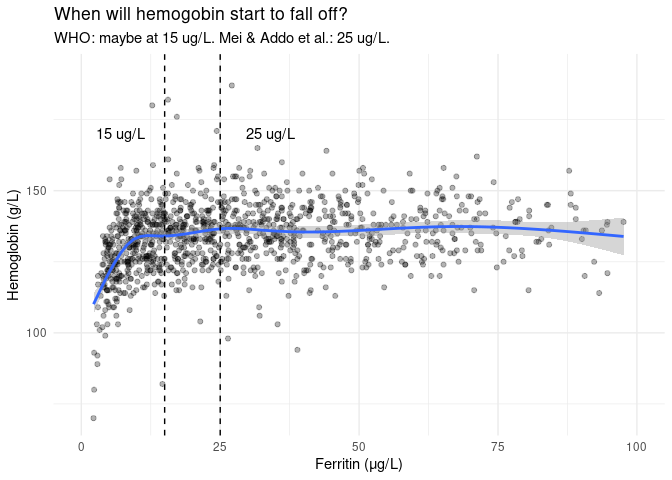
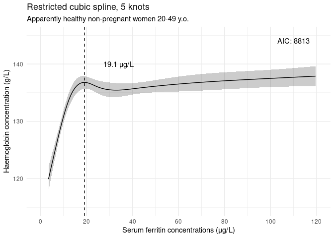
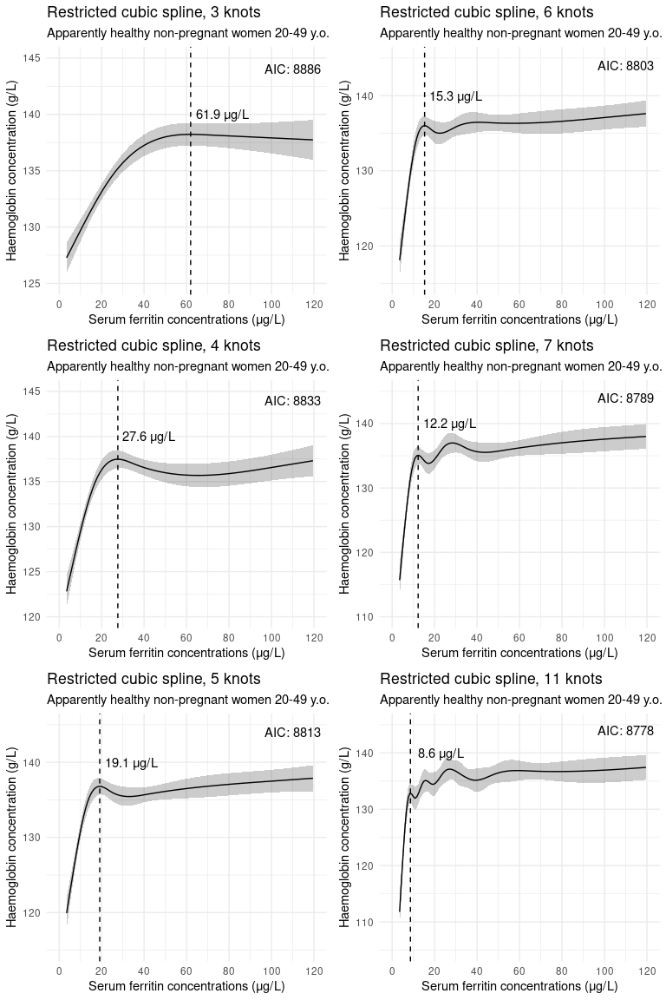
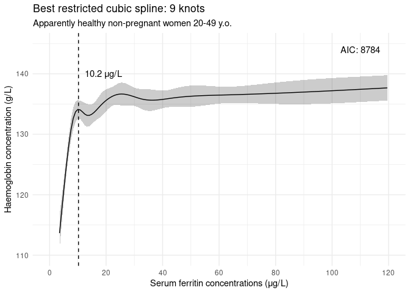
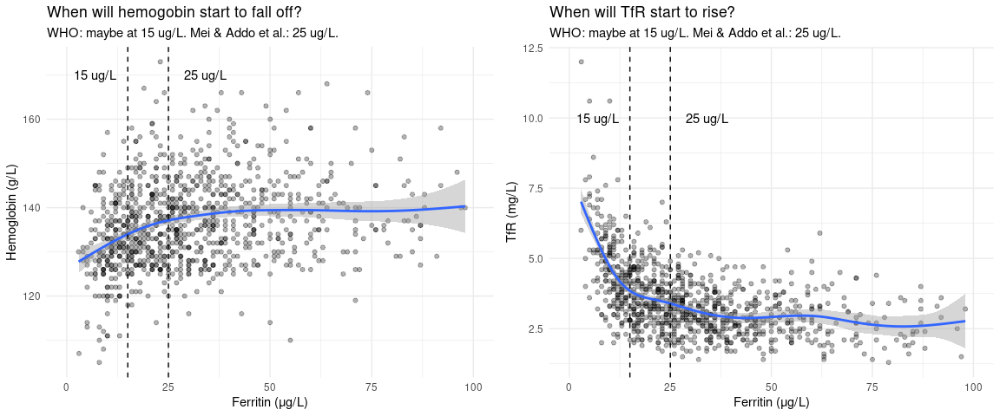
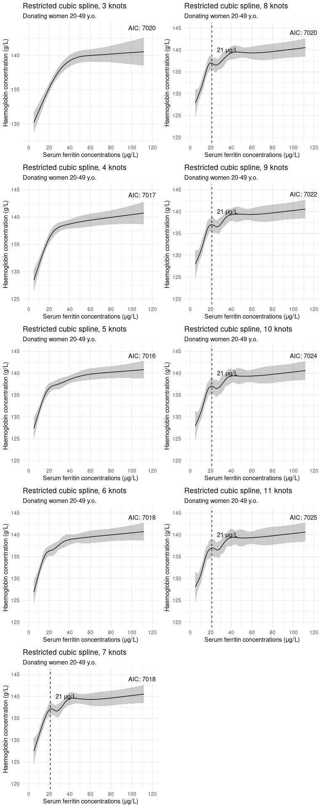
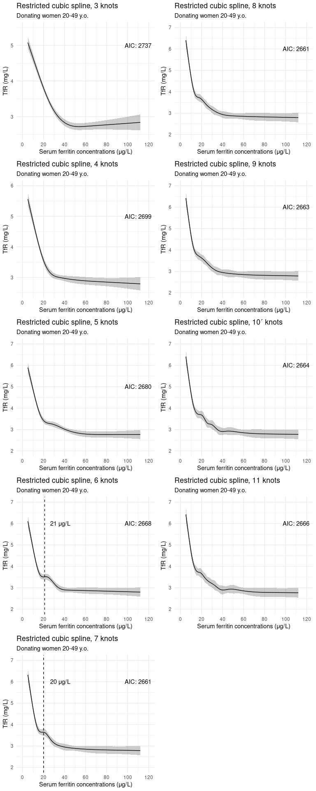
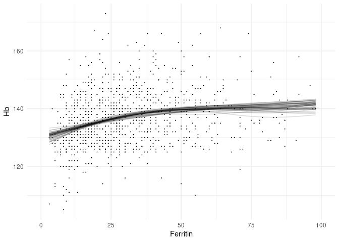
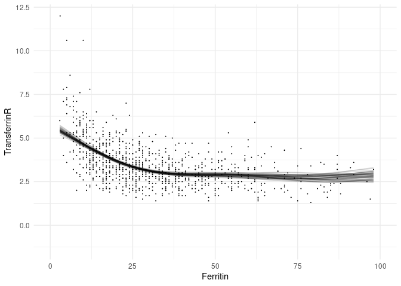
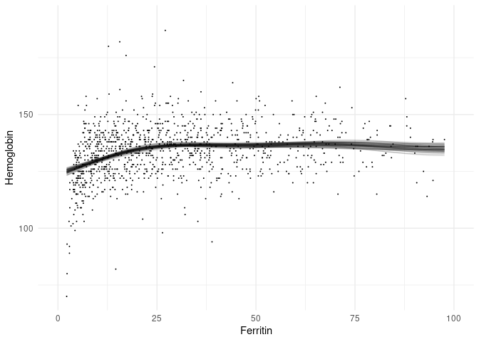

# Intro

The World Health Organization currently recommends a ferritin cut-off of <15 μg/L for iron deficiency in all subpopulations, except children under 5 and pregnant individuals after the first trimester. [[1](https://www.who.int/publications/i/item/9789240000124)] Although these numbers were "updated" in 2020, WHO couldn't find strong evidence for using ferritin as a good marker for iron stores. They still recommend it, as there is high likelihood of it being better than not using it.

In 2021, to conjure some sense into this, Mei et al. [[2](https://www.sciencedirect.com/science/article/abs/pii/S235230262100168X)] (affl. CDC) attempted to tie ferritin into two different physiological measures: hemoglobin and soluble transferritin receptors (sTfR), both indicators of iron-deficient erythropoiesis (layman: "not enough iron to make red blood cells"). They seem to argue that if they can find a similar threshold value for both of these by looking at ferritin, they can "derive a physiological ferritin threshold for iron deficiency". Their cohort consists of "apparently healthy" children and non-pregnant women (15-49 yo) recorded in the US National Health and Nutrition Examination Survey (NHANES). For the purposes of their study, "apparently healthy" means filtering out individuals based on CRP, white blood cell counts, and possible liver disease.

To find this threshold, they chose a restricted cubic spline model with 5 knots. They do not report testing other numbers of knots, nor varying knot positions. In their Supplement they explain that they used the `rcs()` function from the R package `rms` for this. 5 equidistant knots is the default setting for this function, so I'll just assume this was ran as is.

In this report we'll focus on apparently healthy non-pregnant women (by recorded gender, pregnancy status and blood donor eligibility criteria available in the Health 2000 cohort), so here are the results for women in Mei et al. (reproduced without permission!):

<center>

</center>

Mei et al. determine the threshold by computing the zero derivatives of the resulting fits, implicitly arguing that the "plateau before the fall/rise" constitutes as the _de facto_ threshold. The threshold generated this way are 25.2 μg/L and 24.0 μg/L for hemoglobin and sTfR, respectively. These vary somewhat when stratifying by age. It is however immediately interesting that these thresholds settle around the same number for both hemoglobin and sTfR, and that they defy the visual inspection of the scatter plot / median line, which points closer to the WHO threshold.

Later, in 2022, they replicated their results with Retrovirus Epidemiology Donor Study-II Donor Iron Status Evaluation (REDS-RISE) blood donor data (this time Addo et al.). [[3](https://ashpublications.org/bloodadvances/article/6/12/3661/484681/Physiologically-based-serum-ferritin-thresholds)] 

<center>

</center>

# Replication

We're now left with a curiosity: why exactly 5 knots? If we were to try to replicate this, we'd be interested in testing fits with more/less knots, or possibly entirely other approaches. We only have hemoglobin and ferritin to work with in the Health 200 cohort, but let's see how the data looks.

## H2000 data visualized




Our data scatters in a very similar manner to Mei & Addo et al. Visual inspection would suggest that the ferritin threshold for iron deficiency, as indicated by hemoglobin, might even be lower than what WHO suggests. Admittedly, visual inspection is insufficient in determining relative scatter densities and may underestimate.

What will the models show?

## Restricted cubic splines (5 knots)


```r
# Fit
rcs5_h2000 <- ols(Hemoglobin ~ rcs(Ferritin, 5), data = apparently_healthy, x = TRUE, y = TRUE)
# Plot fit
p5_h2000 <- ggplot(Predict(rcs5_h2000)) + 
    geom_vline(xintercept = 19.1053, linetype = "dashed") +
    annotate(geom = "text", label = "19.1 μg/L", x = 34, y = 140) +
    annotate(geom = "text", label = paste("AIC:", as.integer(AIC(rcs5_h2000))), x = 110, y = 144) + 
    scale_x_continuous(breaks = c(0, 20, 40, 60, 80, 100, 120), limits = c(0, 120)) +
    theme_minimal() + 
    labs(title = "Restricted cubic spline, 5 knots",
         subtitle = "Apparently healthy non-pregnant women 20-49 y.o.",
         x = "Serum ferritin concentrations (μg/L)",
         y = "Haemoglobin concentration (g/L)")
p5_h2000
```


The curve shape is somewhat similar to Mei & Addo et al. with their NHANES study. Our model specification ends up being

$$
\begin{eqnarray*}
\hat{y}=\\
& & 113.7922 \\
& & + 1.752375x - 0.00444937 (x - 5.1)_{+}^{3}  \\
& &  +0.007910383  (x-13.065)_{+}^{3}-0.003740607 (x-24.6)_{+}^{3}  \\
& &   +0.000282423  (x-41.235)_{+}^{3}-2.828606\!\times\!10^{-6}(x-100.453)_{+}^{3}  \\
\end{eqnarray*}
$$
$\text{where} \space (x)_{+}=x \space \text{if} \space x > 0, 0 \space \text{otherwise}$. The zero derivative can be computed to be **19.1053 μg/L**. This is closer to the current WHO reference value, than the suggested 25 μg/L, but this is just a curiosity at this point. We need to see what happens with other knot structures.

## 3 to 12 knots


Which of these restricted cubic spline models is best? Out of these, the 11 knot version has the lowest AIC, but is this the global minimum? And does it differ "enough" from simpler models? We can compute the "probability that model *i* is as good as the one that got the lowest AIC" with
$$
\text{P} = e^{\frac{\text{AIC}_{min} - \text{AIC}_i}{2}}.
$$
The idea is that if the model that gets the minimum AIC does not improve significantly from another, we may want to not discriminate between them. Let us choose a significance level of 5\%.


```r
rcs8_h2000 <- ols(Hemoglobin ~ rcs(Ferritin, 8), data = apparently_healthy, x = TRUE, y = TRUE)
rcs9_h2000 <- ols(Hemoglobin ~ rcs(Ferritin, 9), data = apparently_healthy, x = TRUE, y = TRUE)
rcs10_h2000 <- ols(Hemoglobin ~ rcs(Ferritin, 10), data = apparently_healthy, x = TRUE, y = TRUE)
rcs12_h2000 <- ols(Hemoglobin ~ rcs(Ferritin, 12), data = apparently_healthy, x = TRUE, y = TRUE)
AIC_min_h2000 <- min(c(AIC(rcs8_h2000), AIC(rcs9_h2000), AIC(rcs10_h2000), AIC(rcs11_h2000), AIC(rcs12_h2000)))
# The 11 knot version is indeed the global MIN, we do not need to check the P for the 12 knot version as it increases in complexity and AIC.

P7_h2000 <- compare_AIC(AIC_min_h2000, AIC(rcs7_h2000))
P8_h2000 <- compare_AIC(AIC_min_h2000, AIC(rcs8_h2000))
P9_h2000 <- compare_AIC(AIC_min_h2000, AIC(rcs9_h2000))
P10_h2000 <- compare_AIC(AIC_min_h2000, AIC(rcs10_h2000))
```

We find that the 11 knot model does not differ significantly (arbitrary 5\% threshold chosen by us) from 10 and 9 knot models (37\% and 7\% probability of being equally good as the 11 knot version, respectively). With this knowledge, we probably ought to go for the 9 knot model. 


```r
# Plot fit
p9_h2000 <- ggplot(Predict(rcs9_h2000)) + 
    geom_vline(xintercept = 10.2289, linetype = "dashed") +
    annotate(geom = "text", label = "10.2 μg/L", x = 19, y = 140) +
    annotate(geom = "text", label = paste("AIC:", as.integer(AIC(rcs9_h2000))), x = 110, y = 144) + 
    scale_x_continuous(breaks = c(0, 20, 40, 60, 80, 100, 120), limits = c(0, 120)) +
    theme_minimal() + 
    labs(title = "Best restricted cubic spline: 9 knots",
         subtitle = "Apparently healthy non-pregnant women 20-49 y.o.",
         x = "Serum ferritin concentrations (μg/L)",
         y = "Haemoglobin concentration (g/L)")
p9_h2000
```



If this approach is sensible overall is a whole another matter. We arrive at a ferritin threshold greatly below even the WHO recommendation!

## Repeat with FinDonor (and TfR)




## Varying knots | Hb


### Compare AIC

```r
compare_AIC(7016, 7020)
```

```
## [1] 0.1353353
```
--> Not sufficient evidence to choose between 3 knots and 5 knots.

## Varying knots | TfR



```r
compare_AIC(2661, 2664)
```

```
## [1] 0.2231302
```
--> Not enough evidence to choose between RCS7-RCS11, but we might be able to still credibly drop RCS11.

## Now make it Bayesian

### Hb ~ s(Ferritin)


```r
bay <- stan_gamm4(Hb ~ s(Ferritin), data = donors_oi, seed = 100)
```

```
## 
## SAMPLING FOR MODEL 'continuous' NOW (CHAIN 1).
## Chain 1: 
## Chain 1: Gradient evaluation took 3.1e-05 seconds
## Chain 1: 1000 transitions using 10 leapfrog steps per transition would take 0.31 seconds.
## Chain 1: Adjust your expectations accordingly!
## Chain 1: 
## Chain 1: 
## Chain 1: Iteration:    1 / 2000 [  0%]  (Warmup)
## Chain 1: Iteration:  200 / 2000 [ 10%]  (Warmup)
## Chain 1: Iteration:  400 / 2000 [ 20%]  (Warmup)
## Chain 1: Iteration:  600 / 2000 [ 30%]  (Warmup)
## Chain 1: Iteration:  800 / 2000 [ 40%]  (Warmup)
## Chain 1: Iteration: 1000 / 2000 [ 50%]  (Warmup)
## Chain 1: Iteration: 1001 / 2000 [ 50%]  (Sampling)
## Chain 1: Iteration: 1200 / 2000 [ 60%]  (Sampling)
## Chain 1: Iteration: 1400 / 2000 [ 70%]  (Sampling)
## Chain 1: Iteration: 1600 / 2000 [ 80%]  (Sampling)
## Chain 1: Iteration: 1800 / 2000 [ 90%]  (Sampling)
## Chain 1: Iteration: 2000 / 2000 [100%]  (Sampling)
## Chain 1: 
## Chain 1:  Elapsed Time: 0.27949 seconds (Warm-up)
## Chain 1:                0.340356 seconds (Sampling)
## Chain 1:                0.619846 seconds (Total)
## Chain 1: 
## 
## SAMPLING FOR MODEL 'continuous' NOW (CHAIN 2).
## Chain 2: 
## Chain 2: Gradient evaluation took 1.4e-05 seconds
## Chain 2: 1000 transitions using 10 leapfrog steps per transition would take 0.14 seconds.
## Chain 2: Adjust your expectations accordingly!
## Chain 2: 
## Chain 2: 
## Chain 2: Iteration:    1 / 2000 [  0%]  (Warmup)
## Chain 2: Iteration:  200 / 2000 [ 10%]  (Warmup)
## Chain 2: Iteration:  400 / 2000 [ 20%]  (Warmup)
## Chain 2: Iteration:  600 / 2000 [ 30%]  (Warmup)
## Chain 2: Iteration:  800 / 2000 [ 40%]  (Warmup)
## Chain 2: Iteration: 1000 / 2000 [ 50%]  (Warmup)
## Chain 2: Iteration: 1001 / 2000 [ 50%]  (Sampling)
## Chain 2: Iteration: 1200 / 2000 [ 60%]  (Sampling)
## Chain 2: Iteration: 1400 / 2000 [ 70%]  (Sampling)
## Chain 2: Iteration: 1600 / 2000 [ 80%]  (Sampling)
## Chain 2: Iteration: 1800 / 2000 [ 90%]  (Sampling)
## Chain 2: Iteration: 2000 / 2000 [100%]  (Sampling)
## Chain 2: 
## Chain 2:  Elapsed Time: 0.30705 seconds (Warm-up)
## Chain 2:                0.262812 seconds (Sampling)
## Chain 2:                0.569862 seconds (Total)
## Chain 2: 
## 
## SAMPLING FOR MODEL 'continuous' NOW (CHAIN 3).
## Chain 3: 
## Chain 3: Gradient evaluation took 1.3e-05 seconds
## Chain 3: 1000 transitions using 10 leapfrog steps per transition would take 0.13 seconds.
## Chain 3: Adjust your expectations accordingly!
## Chain 3: 
## Chain 3: 
## Chain 3: Iteration:    1 / 2000 [  0%]  (Warmup)
## Chain 3: Iteration:  200 / 2000 [ 10%]  (Warmup)
## Chain 3: Iteration:  400 / 2000 [ 20%]  (Warmup)
## Chain 3: Iteration:  600 / 2000 [ 30%]  (Warmup)
## Chain 3: Iteration:  800 / 2000 [ 40%]  (Warmup)
## Chain 3: Iteration: 1000 / 2000 [ 50%]  (Warmup)
## Chain 3: Iteration: 1001 / 2000 [ 50%]  (Sampling)
## Chain 3: Iteration: 1200 / 2000 [ 60%]  (Sampling)
## Chain 3: Iteration: 1400 / 2000 [ 70%]  (Sampling)
## Chain 3: Iteration: 1600 / 2000 [ 80%]  (Sampling)
## Chain 3: Iteration: 1800 / 2000 [ 90%]  (Sampling)
## Chain 3: Iteration: 2000 / 2000 [100%]  (Sampling)
## Chain 3: 
## Chain 3:  Elapsed Time: 0.290865 seconds (Warm-up)
## Chain 3:                0.253149 seconds (Sampling)
## Chain 3:                0.544014 seconds (Total)
## Chain 3: 
## 
## SAMPLING FOR MODEL 'continuous' NOW (CHAIN 4).
## Chain 4: 
## Chain 4: Gradient evaluation took 1.4e-05 seconds
## Chain 4: 1000 transitions using 10 leapfrog steps per transition would take 0.14 seconds.
## Chain 4: Adjust your expectations accordingly!
## Chain 4: 
## Chain 4: 
## Chain 4: Iteration:    1 / 2000 [  0%]  (Warmup)
## Chain 4: Iteration:  200 / 2000 [ 10%]  (Warmup)
## Chain 4: Iteration:  400 / 2000 [ 20%]  (Warmup)
## Chain 4: Iteration:  600 / 2000 [ 30%]  (Warmup)
## Chain 4: Iteration:  800 / 2000 [ 40%]  (Warmup)
## Chain 4: Iteration: 1000 / 2000 [ 50%]  (Warmup)
## Chain 4: Iteration: 1001 / 2000 [ 50%]  (Sampling)
## Chain 4: Iteration: 1200 / 2000 [ 60%]  (Sampling)
## Chain 4: Iteration: 1400 / 2000 [ 70%]  (Sampling)
## Chain 4: Iteration: 1600 / 2000 [ 80%]  (Sampling)
## Chain 4: Iteration: 1800 / 2000 [ 90%]  (Sampling)
## Chain 4: Iteration: 2000 / 2000 [100%]  (Sampling)
## Chain 4: 
## Chain 4:  Elapsed Time: 0.306681 seconds (Warm-up)
## Chain 4:                0.416756 seconds (Sampling)
## Chain 4:                0.723437 seconds (Total)
## Chain 4:
```


```r
print(bay)
```

```
## stan_gamm4
##  family:       gaussian [identity]
##  formula:      Hb ~ s(Ferritin)
##  observations: 960
## ------
##               Median MAD_SD
## (Intercept)    136.6    0.3
## s(Ferritin).1   23.2   36.5
## s(Ferritin).2   -4.6   45.2
## s(Ferritin).3   15.2   16.3
## s(Ferritin).4   16.0   47.3
## s(Ferritin).5   12.6   43.0
## s(Ferritin).6  -32.5   47.5
## s(Ferritin).7   85.8   36.7
## s(Ferritin).8 -103.6   33.0
## s(Ferritin).9    0.5    5.5
## 
## Auxiliary parameter(s):
##       Median MAD_SD
## sigma 9.4    0.2   
## 
## Smoothing terms:
##                         Median MAD_SD
## smooth_sd[s(Ferritin)1] 50.2   16.4  
## smooth_sd[s(Ferritin)2]  6.4    7.0  
## 
## ------
## * For help interpreting the printed output see ?print.stanreg
## * For info on the priors used see ?prior_summary.stanreg
```


```r
donors_Fer_Hb <- donors_oi %>% select(Ferritin, Hb) %>% na.omit()
donors_Fer_TfR <- donors_oi %>% select(Ferritin, TransferrinR) %>% na.omit()
donors_Fer_Hb %>%
  add_fitted_draws(bay, n = 50) %>%
  ggplot(aes(x = Ferritin, y = Hb)) +
    geom_line(aes(y = .value, group = .draw), alpha = 0.15) + 
    geom_point(data = donors_Fer_Hb, size = 0.05) + 
    xlim(c(0, 100)) +
    theme_minimal()
```



### TfR ~ s(Ferritin)


```r
bay2 <- stan_gamm4(TransferrinR ~ s(Ferritin), data = donors_oi, seed = 100)
```

```
## 
## SAMPLING FOR MODEL 'continuous' NOW (CHAIN 1).
## Chain 1: 
## Chain 1: Gradient evaluation took 2.2e-05 seconds
## Chain 1: 1000 transitions using 10 leapfrog steps per transition would take 0.22 seconds.
## Chain 1: Adjust your expectations accordingly!
## Chain 1: 
## Chain 1: 
## Chain 1: Iteration:    1 / 2000 [  0%]  (Warmup)
## Chain 1: Iteration:  200 / 2000 [ 10%]  (Warmup)
## Chain 1: Iteration:  400 / 2000 [ 20%]  (Warmup)
## Chain 1: Iteration:  600 / 2000 [ 30%]  (Warmup)
## Chain 1: Iteration:  800 / 2000 [ 40%]  (Warmup)
## Chain 1: Iteration: 1000 / 2000 [ 50%]  (Warmup)
## Chain 1: Iteration: 1001 / 2000 [ 50%]  (Sampling)
## Chain 1: Iteration: 1200 / 2000 [ 60%]  (Sampling)
## Chain 1: Iteration: 1400 / 2000 [ 70%]  (Sampling)
## Chain 1: Iteration: 1600 / 2000 [ 80%]  (Sampling)
## Chain 1: Iteration: 1800 / 2000 [ 90%]  (Sampling)
## Chain 1: Iteration: 2000 / 2000 [100%]  (Sampling)
## Chain 1: 
## Chain 1:  Elapsed Time: 0.439648 seconds (Warm-up)
## Chain 1:                0.429555 seconds (Sampling)
## Chain 1:                0.869203 seconds (Total)
## Chain 1: 
## 
## SAMPLING FOR MODEL 'continuous' NOW (CHAIN 2).
## Chain 2: 
## Chain 2: Gradient evaluation took 1.3e-05 seconds
## Chain 2: 1000 transitions using 10 leapfrog steps per transition would take 0.13 seconds.
## Chain 2: Adjust your expectations accordingly!
## Chain 2: 
## Chain 2: 
## Chain 2: Iteration:    1 / 2000 [  0%]  (Warmup)
## Chain 2: Iteration:  200 / 2000 [ 10%]  (Warmup)
## Chain 2: Iteration:  400 / 2000 [ 20%]  (Warmup)
## Chain 2: Iteration:  600 / 2000 [ 30%]  (Warmup)
## Chain 2: Iteration:  800 / 2000 [ 40%]  (Warmup)
## Chain 2: Iteration: 1000 / 2000 [ 50%]  (Warmup)
## Chain 2: Iteration: 1001 / 2000 [ 50%]  (Sampling)
## Chain 2: Iteration: 1200 / 2000 [ 60%]  (Sampling)
## Chain 2: Iteration: 1400 / 2000 [ 70%]  (Sampling)
## Chain 2: Iteration: 1600 / 2000 [ 80%]  (Sampling)
## Chain 2: Iteration: 1800 / 2000 [ 90%]  (Sampling)
## Chain 2: Iteration: 2000 / 2000 [100%]  (Sampling)
## Chain 2: 
## Chain 2:  Elapsed Time: 0.398339 seconds (Warm-up)
## Chain 2:                0.455305 seconds (Sampling)
## Chain 2:                0.853644 seconds (Total)
## Chain 2: 
## 
## SAMPLING FOR MODEL 'continuous' NOW (CHAIN 3).
## Chain 3: 
## Chain 3: Gradient evaluation took 1.3e-05 seconds
## Chain 3: 1000 transitions using 10 leapfrog steps per transition would take 0.13 seconds.
## Chain 3: Adjust your expectations accordingly!
## Chain 3: 
## Chain 3: 
## Chain 3: Iteration:    1 / 2000 [  0%]  (Warmup)
## Chain 3: Iteration:  200 / 2000 [ 10%]  (Warmup)
## Chain 3: Iteration:  400 / 2000 [ 20%]  (Warmup)
## Chain 3: Iteration:  600 / 2000 [ 30%]  (Warmup)
## Chain 3: Iteration:  800 / 2000 [ 40%]  (Warmup)
## Chain 3: Iteration: 1000 / 2000 [ 50%]  (Warmup)
## Chain 3: Iteration: 1001 / 2000 [ 50%]  (Sampling)
## Chain 3: Iteration: 1200 / 2000 [ 60%]  (Sampling)
## Chain 3: Iteration: 1400 / 2000 [ 70%]  (Sampling)
## Chain 3: Iteration: 1600 / 2000 [ 80%]  (Sampling)
## Chain 3: Iteration: 1800 / 2000 [ 90%]  (Sampling)
## Chain 3: Iteration: 2000 / 2000 [100%]  (Sampling)
## Chain 3: 
## Chain 3:  Elapsed Time: 0.457885 seconds (Warm-up)
## Chain 3:                0.474553 seconds (Sampling)
## Chain 3:                0.932438 seconds (Total)
## Chain 3: 
## 
## SAMPLING FOR MODEL 'continuous' NOW (CHAIN 4).
## Chain 4: 
## Chain 4: Gradient evaluation took 1.3e-05 seconds
## Chain 4: 1000 transitions using 10 leapfrog steps per transition would take 0.13 seconds.
## Chain 4: Adjust your expectations accordingly!
## Chain 4: 
## Chain 4: 
## Chain 4: Iteration:    1 / 2000 [  0%]  (Warmup)
## Chain 4: Iteration:  200 / 2000 [ 10%]  (Warmup)
## Chain 4: Iteration:  400 / 2000 [ 20%]  (Warmup)
## Chain 4: Iteration:  600 / 2000 [ 30%]  (Warmup)
## Chain 4: Iteration:  800 / 2000 [ 40%]  (Warmup)
## Chain 4: Iteration: 1000 / 2000 [ 50%]  (Warmup)
## Chain 4: Iteration: 1001 / 2000 [ 50%]  (Sampling)
## Chain 4: Iteration: 1200 / 2000 [ 60%]  (Sampling)
## Chain 4: Iteration: 1400 / 2000 [ 70%]  (Sampling)
## Chain 4: Iteration: 1600 / 2000 [ 80%]  (Sampling)
## Chain 4: Iteration: 1800 / 2000 [ 90%]  (Sampling)
## Chain 4: Iteration: 2000 / 2000 [100%]  (Sampling)
## Chain 4: 
## Chain 4:  Elapsed Time: 0.453079 seconds (Warm-up)
## Chain 4:                0.499095 seconds (Sampling)
## Chain 4:                0.952174 seconds (Total)
## Chain 4:
```

```
## Warning: There were 3 divergent transitions after warmup. See
## https://mc-stan.org/misc/warnings.html#divergent-transitions-after-warmup
## to find out why this is a problem and how to eliminate them.
```

```
## Warning: Examine the pairs() plot to diagnose sampling problems
```


```r
print(bay2)
```

```
## stan_gamm4
##  family:       gaussian [identity]
##  formula:      TransferrinR ~ s(Ferritin)
##  observations: 960
## ------
##               Median MAD_SD
## (Intercept)     3.5    0.0 
## s(Ferritin).1   8.3    6.7 
## s(Ferritin).2   8.3   12.6 
## s(Ferritin).3  -4.7    2.4 
## s(Ferritin).4  -7.8   13.0 
## s(Ferritin).5  15.9    9.4 
## s(Ferritin).6  26.4    8.7 
## s(Ferritin).7 -40.7    4.7 
## s(Ferritin).8  42.2    4.4 
## s(Ferritin).9  -0.2    0.7 
## 
## Auxiliary parameter(s):
##       Median MAD_SD
## sigma 1.0    0.0   
## 
## Smoothing terms:
##                         Median MAD_SD
## smooth_sd[s(Ferritin)1] 15.4    2.4  
## smooth_sd[s(Ferritin)2]  0.8    0.9  
## 
## ------
## * For help interpreting the printed output see ?print.stanreg
## * For info on the priors used see ?prior_summary.stanreg
```


```r
donors_Fer_TfR %>%
  add_fitted_draws(bay2, n = 50) %>%
  ggplot(aes(x = Ferritin, y = TransferrinR)) +
    geom_line(aes(y = .value, group = .draw), alpha = 0.15) + 
    geom_point(data = donors_Fer_TfR, size = 0.05) + 
    xlim(c(0, 100)) +
    theme_minimal()
```



### Bayesian for H2000


```r
bay3 <- stan_gamm4(Hemoglobin ~ s(Ferritin), data = apparently_healthy, seed = 100)
```

```
## 
## SAMPLING FOR MODEL 'continuous' NOW (CHAIN 1).
## Chain 1: 
## Chain 1: Gradient evaluation took 2.3e-05 seconds
## Chain 1: 1000 transitions using 10 leapfrog steps per transition would take 0.23 seconds.
## Chain 1: Adjust your expectations accordingly!
## Chain 1: 
## Chain 1: 
## Chain 1: Iteration:    1 / 2000 [  0%]  (Warmup)
## Chain 1: Iteration:  200 / 2000 [ 10%]  (Warmup)
## Chain 1: Iteration:  400 / 2000 [ 20%]  (Warmup)
## Chain 1: Iteration:  600 / 2000 [ 30%]  (Warmup)
## Chain 1: Iteration:  800 / 2000 [ 40%]  (Warmup)
## Chain 1: Iteration: 1000 / 2000 [ 50%]  (Warmup)
## Chain 1: Iteration: 1001 / 2000 [ 50%]  (Sampling)
## Chain 1: Iteration: 1200 / 2000 [ 60%]  (Sampling)
## Chain 1: Iteration: 1400 / 2000 [ 70%]  (Sampling)
## Chain 1: Iteration: 1600 / 2000 [ 80%]  (Sampling)
## Chain 1: Iteration: 1800 / 2000 [ 90%]  (Sampling)
## Chain 1: Iteration: 2000 / 2000 [100%]  (Sampling)
## Chain 1: 
## Chain 1:  Elapsed Time: 0.49638 seconds (Warm-up)
## Chain 1:                0.745244 seconds (Sampling)
## Chain 1:                1.24162 seconds (Total)
## Chain 1: 
## 
## SAMPLING FOR MODEL 'continuous' NOW (CHAIN 2).
## Chain 2: 
## Chain 2: Gradient evaluation took 1.9e-05 seconds
## Chain 2: 1000 transitions using 10 leapfrog steps per transition would take 0.19 seconds.
## Chain 2: Adjust your expectations accordingly!
## Chain 2: 
## Chain 2: 
## Chain 2: Iteration:    1 / 2000 [  0%]  (Warmup)
## Chain 2: Iteration:  200 / 2000 [ 10%]  (Warmup)
## Chain 2: Iteration:  400 / 2000 [ 20%]  (Warmup)
## Chain 2: Iteration:  600 / 2000 [ 30%]  (Warmup)
## Chain 2: Iteration:  800 / 2000 [ 40%]  (Warmup)
## Chain 2: Iteration: 1000 / 2000 [ 50%]  (Warmup)
## Chain 2: Iteration: 1001 / 2000 [ 50%]  (Sampling)
## Chain 2: Iteration: 1200 / 2000 [ 60%]  (Sampling)
## Chain 2: Iteration: 1400 / 2000 [ 70%]  (Sampling)
## Chain 2: Iteration: 1600 / 2000 [ 80%]  (Sampling)
## Chain 2: Iteration: 1800 / 2000 [ 90%]  (Sampling)
## Chain 2: Iteration: 2000 / 2000 [100%]  (Sampling)
## Chain 2: 
## Chain 2:  Elapsed Time: 0.478192 seconds (Warm-up)
## Chain 2:                0.619086 seconds (Sampling)
## Chain 2:                1.09728 seconds (Total)
## Chain 2: 
## 
## SAMPLING FOR MODEL 'continuous' NOW (CHAIN 3).
## Chain 3: 
## Chain 3: Gradient evaluation took 1.8e-05 seconds
## Chain 3: 1000 transitions using 10 leapfrog steps per transition would take 0.18 seconds.
## Chain 3: Adjust your expectations accordingly!
## Chain 3: 
## Chain 3: 
## Chain 3: Iteration:    1 / 2000 [  0%]  (Warmup)
## Chain 3: Iteration:  200 / 2000 [ 10%]  (Warmup)
## Chain 3: Iteration:  400 / 2000 [ 20%]  (Warmup)
## Chain 3: Iteration:  600 / 2000 [ 30%]  (Warmup)
## Chain 3: Iteration:  800 / 2000 [ 40%]  (Warmup)
## Chain 3: Iteration: 1000 / 2000 [ 50%]  (Warmup)
## Chain 3: Iteration: 1001 / 2000 [ 50%]  (Sampling)
## Chain 3: Iteration: 1200 / 2000 [ 60%]  (Sampling)
## Chain 3: Iteration: 1400 / 2000 [ 70%]  (Sampling)
## Chain 3: Iteration: 1600 / 2000 [ 80%]  (Sampling)
## Chain 3: Iteration: 1800 / 2000 [ 90%]  (Sampling)
## Chain 3: Iteration: 2000 / 2000 [100%]  (Sampling)
## Chain 3: 
## Chain 3:  Elapsed Time: 0.458262 seconds (Warm-up)
## Chain 3:                0.582859 seconds (Sampling)
## Chain 3:                1.04112 seconds (Total)
## Chain 3: 
## 
## SAMPLING FOR MODEL 'continuous' NOW (CHAIN 4).
## Chain 4: 
## Chain 4: Gradient evaluation took 1.4e-05 seconds
## Chain 4: 1000 transitions using 10 leapfrog steps per transition would take 0.14 seconds.
## Chain 4: Adjust your expectations accordingly!
## Chain 4: 
## Chain 4: 
## Chain 4: Iteration:    1 / 2000 [  0%]  (Warmup)
## Chain 4: Iteration:  200 / 2000 [ 10%]  (Warmup)
## Chain 4: Iteration:  400 / 2000 [ 20%]  (Warmup)
## Chain 4: Iteration:  600 / 2000 [ 30%]  (Warmup)
## Chain 4: Iteration:  800 / 2000 [ 40%]  (Warmup)
## Chain 4: Iteration: 1000 / 2000 [ 50%]  (Warmup)
## Chain 4: Iteration: 1001 / 2000 [ 50%]  (Sampling)
## Chain 4: Iteration: 1200 / 2000 [ 60%]  (Sampling)
## Chain 4: Iteration: 1400 / 2000 [ 70%]  (Sampling)
## Chain 4: Iteration: 1600 / 2000 [ 80%]  (Sampling)
## Chain 4: Iteration: 1800 / 2000 [ 90%]  (Sampling)
## Chain 4: Iteration: 2000 / 2000 [100%]  (Sampling)
## Chain 4: 
## Chain 4:  Elapsed Time: 0.446454 seconds (Warm-up)
## Chain 4:                0.467703 seconds (Sampling)
## Chain 4:                0.914157 seconds (Total)
## Chain 4:
```

```
## Warning: There were 1 divergent transitions after warmup. See
## https://mc-stan.org/misc/warnings.html#divergent-transitions-after-warmup
## to find out why this is a problem and how to eliminate them.
```

```
## Warning: Examine the pairs() plot to diagnose sampling problems
```


```r
print(bay3)
```

```
## stan_gamm4
##  family:       gaussian [identity]
##  formula:      Hemoglobin ~ s(Ferritin)
##  observations: 1160
## ------
##               Median MAD_SD
## (Intercept)    133.9    0.3
## s(Ferritin).1  -27.1   74.4
## s(Ferritin).2 -107.6   36.4
## s(Ferritin).3   44.0   85.2
## s(Ferritin).4  224.5  108.4
## s(Ferritin).5  -21.7   13.2
## s(Ferritin).6  168.1   66.3
## s(Ferritin).7  224.9   40.0
## s(Ferritin).8 -169.1   31.7
## s(Ferritin).9    3.4    9.4
## 
## Auxiliary parameter(s):
##       Median MAD_SD
## sigma 11.0    0.2  
## 
## Smoothing terms:
##                         Median MAD_SD
## smooth_sd[s(Ferritin)1] 109.3   26.0 
## smooth_sd[s(Ferritin)2]  10.4   11.3 
## 
## ------
## * For help interpreting the printed output see ?print.stanreg
## * For info on the priors used see ?prior_summary.stanreg
```


```r
na.omit(apparently_healthy) %>%
  add_fitted_draws(bay3, n = 50) %>%
  ggplot(aes(x = Ferritin, y = Hemoglobin)) +
    geom_line(aes(y = .value, group = .draw), alpha = 0.15) + 
    geom_point(data = apparently_healthy, size = 0.05) + 
    xlim(c(0, 100)) +
    theme_minimal()
```



# References
1. World Health Organization. (2020). WHO guideline on use of ferritin concentrations to assess iron status in populations. World Health Organization. ISBN: 978-92-4-000012-4
2. Mei Z, Addo OY, Jefferds ME, Sharma AJ, Flores-Ayala RC, Brittenham GM. Physiologically based serum ferritin thresholds for iron deficiency in children and non-pregnant women: a US National Health and Nutrition Examination Surveys (NHANES) serial cross-sectional study. The Lancet Haematology. 2021;8(8):e572-e582. doi:10.1016/S2352-3026(21)00168-X
3. Addo OY, Mei Z, Hod EA, et al. Physiologically based serum ferritin thresholds for iron deficiency in women of reproductive age who are blood donors. Blood Advances. 2022;6(12):3661-3665. doi:10.1182/bloodadvances.2022007066
