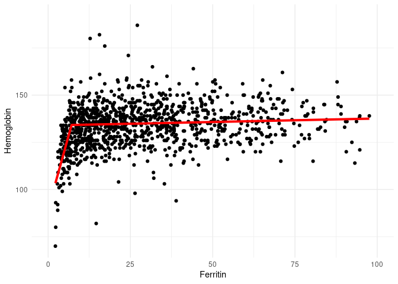
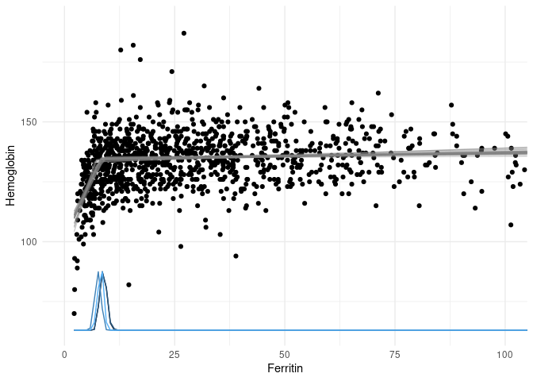
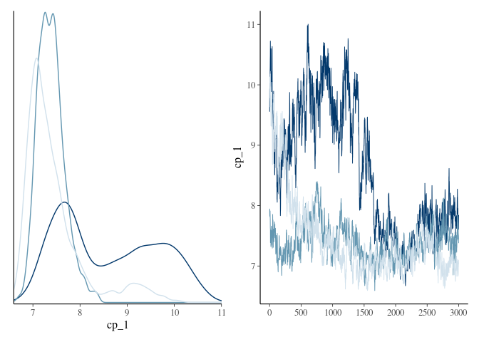
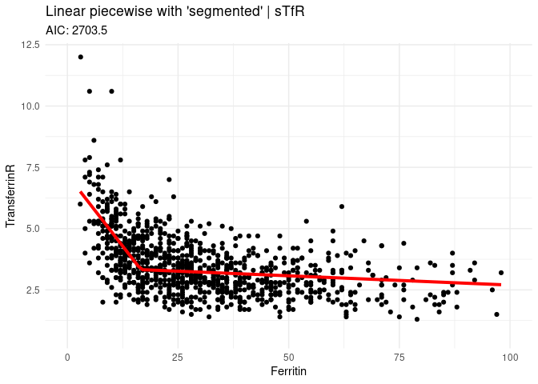
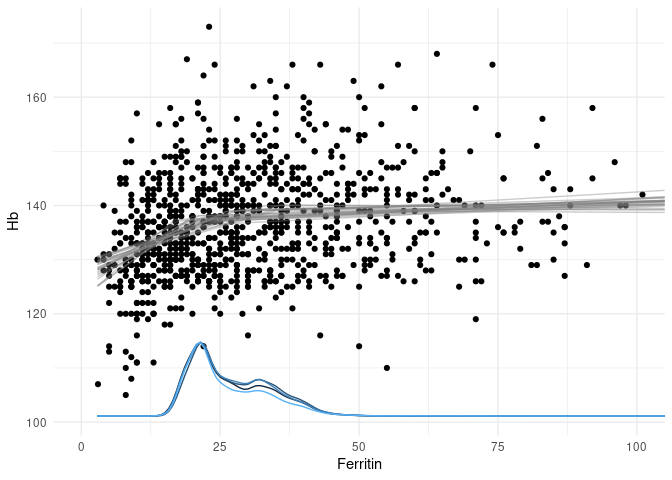
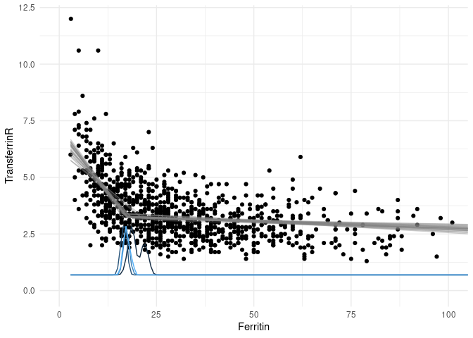
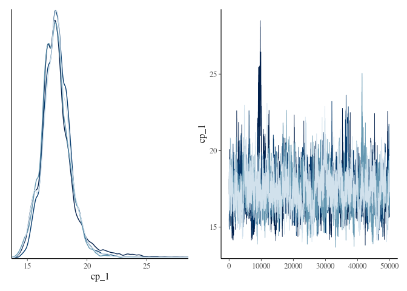

# Intro

The World Health Organization currently recommends a ferritin cut-off of <15 μg/L for iron deficiency in all subpopulations, except children under 5 and pregnant individuals after the first trimester. [[1](https://www.who.int/publications/i/item/9789240000124)] Although these numbers were "updated" in 2020, WHO couldn't find strong evidence for using ferritin as a good marker for iron stores. They still recommend it, as there is high likelihood of it being better than not using it.

In 2021, to conjure some sense into this, Mei et al. [[2](https://www.sciencedirect.com/science/article/abs/pii/S235230262100168X)] (affl. CDC) attempted to tie ferritin into two different physiological measures: hemoglobin and soluble transferritin receptors (sTfR), both indicators of iron-deficient erythropoiesis (layman: "not enough iron to make red blood cells"). They seem to argue that if they can find a similar threshold value for both of these by looking at ferritin, they can "derive a physiological ferritin threshold for iron deficiency". Their cohort consists of "apparently healthy" children and non-pregnant women (15-49 yo) recorded in the US National Health and Nutrition Examination Survey (NHANES). For the purposes of their study, "apparently healthy" means filtering out individuals based on CRP, white blood cell counts, and possible liver disease.

To find this threshold, they chose a restricted cubic spline model with 5 knots. They do not report testing other numbers of knots, nor varying knot positions. In their Supplement they explain that they used the `rcs()` function from the R package `rms` for this. 5 equidistant knots is the default setting for this function, so I'll just assume this was ran as is.

In this report we'll focus on apparently healthy non-pregnant women (by recorded gender, pregnancy status and blood donor eligibility criteria available in the Health 2000 cohort), so here are the results for women in Mei et al. (reproduced without permission!):

<center>

</center>

Mei et al. determine the threshold by computing the zero derivatives of the resulting fits, implicitly arguing that the "plateau before the fall/rise" constitutes as the _de facto_ threshold. The threshold generated this way are 25.2 μg/L and 24.0 μg/L for hemoglobin and sTfR, respectively. These vary somewhat when stratifying by age. It is however immediately interesting that these thresholds settle around the same number for both hemoglobin and sTfR, and that they defy the visual inspection of the scatter plot / median line, which points closer to the WHO threshold.

Later, in 2022, they replicated their results with Retrovirus Epidemiology Donor Study-II Donor Iron Status Evaluation (REDS-RISE) blood donor data (this time Addo et al.). [[3](https://ashpublications.org/bloodadvances/article/6/12/3661/484681/Physiologically-based-serum-ferritin-thresholds)] 

<center>

</center>

# Replication

We're now left with a curiosity: why exactly 5 knots? If we were to try to replicate this, we'd be interested in testing fits with more/less knots, or possibly entirely other approaches. We only have hemoglobin and ferritin to work with in the Health 200 cohort, but let's see how the data looks.

## H2000 data visualized


Our data scatters in a very similar manner to Mei & Addo et al. Visual inspection would suggest that the ferritin threshold for iron deficiency, as indicated by hemoglobin, might even be lower than what WHO suggests. Admittedly, visual inspection is insufficient in determining relative scatter densities and may underestimate.

What will the models show?

## Restricted cubic splines (5 knots)


```r
# Fit
rcs5_h2000 <- ols(Hemoglobin ~ rcs(Ferritin, 5), data = apparently_healthy, x = TRUE, y = TRUE)
# Plot fit
p5_h2000 <- ggplot(Predict(rcs5_h2000)) + 
    geom_vline(xintercept = 19.1053, linetype = "dashed") +
    annotate(geom = "text", label = "19.1 μg/L", x = 34, y = 140) +
    annotate(geom = "text", label = paste("AIC:", as.integer(AIC(rcs5_h2000))), x = 110, y = 144) + 
    scale_x_continuous(breaks = c(0, 20, 40, 60, 80, 100, 120), limits = c(0, 120)) +
    theme_minimal() + 
    labs(title = "Restricted cubic spline, 5 knots",
         subtitle = "Apparently healthy non-pregnant women 20-49 y.o.",
         x = "Serum ferritin concentrations (μg/L)",
         y = "Haemoglobin concentration (g/L)")
p5_h2000
```


The curve shape is somewhat similar to Mei & Addo et al. with their NHANES study. Our model specification ends up being

$$
\begin{eqnarray*}
\hat{y}=\\
& & 113.7922 \\
& & + 1.752375x - 0.00444937 (x - 5.1)_{+}^{3}  \\
& &  +0.007910383  (x-13.065)_{+}^{3}-0.003740607 (x-24.6)_{+}^{3}  \\
& &   +0.000282423  (x-41.235)_{+}^{3}-2.828606\!\times\!10^{-6}(x-100.453)_{+}^{3}  \\
\end{eqnarray*}
$$
$\text{where} \space (x)_{+}=x \space \text{if} \space x > 0, 0 \space \text{otherwise}$. The zero derivative can be computed to be **19.1053 μg/L**. This is closer to the current WHO reference value, than the suggested 25 μg/L, but this is just a curiosity at this point. We need to see what happens with other knot structures.

## 3 to 12 knots


Which of these restricted cubic spline models is best? Out of these, the 11 knot version has the lowest AIC, but is this the global minimum? And does it differ "enough" from simpler models? We can compute the "probability that model *i* is as good as the one that got the lowest AIC" with
$$
\text{P} = e^{\frac{\text{AIC}_{min} - \text{AIC}_i}{2}}.
$$
The idea is that if the model that gets the minimum AIC does not improve significantly from another, we may want to not discriminate between them. Let us choose a significance level of 5\%.


```r
rcs8_h2000 <- ols(Hemoglobin ~ rcs(Ferritin, 8), data = apparently_healthy, x = TRUE, y = TRUE)
rcs9_h2000 <- ols(Hemoglobin ~ rcs(Ferritin, 9), data = apparently_healthy, x = TRUE, y = TRUE)
rcs10_h2000 <- ols(Hemoglobin ~ rcs(Ferritin, 10), data = apparently_healthy, x = TRUE, y = TRUE)
rcs12_h2000 <- ols(Hemoglobin ~ rcs(Ferritin, 12), data = apparently_healthy, x = TRUE, y = TRUE)
AIC_min_h2000 <- min(c(AIC(rcs8_h2000), AIC(rcs9_h2000), AIC(rcs10_h2000), AIC(rcs11_h2000), AIC(rcs12_h2000)))
# The 11 knot version is indeed the global MIN, we do not need to check the P for the 12 knot version as it increases in complexity and AIC.

P7_h2000 <- compare_AIC(AIC_min_h2000, AIC(rcs7_h2000))
P8_h2000 <- compare_AIC(AIC_min_h2000, AIC(rcs8_h2000))
P9_h2000 <- compare_AIC(AIC_min_h2000, AIC(rcs9_h2000))
P10_h2000 <- compare_AIC(AIC_min_h2000, AIC(rcs10_h2000))
```

We find that the 11 knot model does not differ significantly (arbitrary 5\% threshold chosen by us) from 10 and 9 knot models (37\% and 7\% probability of being equally good as the 11 knot version, respectively). With this knowledge, we probably ought to go for the 9 knot model. 


```r
# Plot fit
p9_h2000 <- ggplot(Predict(rcs9_h2000)) + 
    geom_vline(xintercept = 10.2289, linetype = "dashed") +
    annotate(geom = "text", label = "10.2 μg/L", x = 19, y = 140) +
    annotate(geom = "text", label = paste("AIC:", as.integer(AIC(rcs9_h2000))), x = 110, y = 144) + 
    scale_x_continuous(breaks = c(0, 20, 40, 60, 80, 100, 120), limits = c(0, 120)) +
    theme_minimal() + 
    labs(title = "Best restricted cubic spline: 9 knots",
         subtitle = "Apparently healthy non-pregnant women 20-49 y.o.",
         x = "Serum ferritin concentrations (μg/L)",
         y = "Haemoglobin concentration (g/L)")
p9_h2000
```


If this approach is sensible overall is a whole another matter. We arrive at a ferritin threshold greatly below even the WHO recommendation!

## Repeat with FinDonor (and TfR)


## Varying knots | Hb


### Compare AIC

```r
compare_AIC(7016, 7020)
```

```
## [1] 0.1353353
```
--> Not sufficient evidence to choose between 3 knots and 5 knots.

## Varying knots | TfR


```r
compare_AIC(2661, 2664)
```

```
## [1] 0.2231302
```
--> Not enough evidence to choose between RCS7-RCS11, but we might be able to still credibly drop RCS11.

## Breakpoint analysis | H2000

Let's use piecewise linear regression to estimate a breakpoint. We'll do it by using two different packages: `segmented` and `mcp`.

### Using `segmented` 


```r
# Create first a linear model
h2000_lm <- lm(Hemoglobin ~ Ferritin, data = apparently_healthy)
# Then estimate 
segfit <- segmented(h2000_lm)
# Summarize
summary(segfit)
```

```
## 
## 	***Regression Model with Segmented Relationship(s)***
## 
## Call: 
## segmented.lm(obj = h2000_lm)
## 
## Estimated Break-Point(s):
##                 Est. St.Err
## psi1.Ferritin 7.114   0.28
## 
## Meaningful coefficients of the linear terms:
##             Estimate Std. Error t value Pr(>|t|)    
## (Intercept)  89.5324     4.1606  21.519  < 2e-16 ***
## Ferritin      6.2758     0.7700   8.150 9.37e-16 ***
## U1.Ferritin  -6.2389     0.7701  -8.102       NA    
## ---
## Signif. codes:  0 '***' 0.001 '**' 0.01 '*' 0.05 '.' 0.1 ' ' 1
## 
## Residual standard error: 10.61 on 1156 degrees of freedom
## Multiple R-Squared: 0.1794,  Adjusted R-squared: 0.1773 
## 
## Boot restarting based on 6 samples. Last fit:
## Convergence attained in 2 iterations (rel. change 1.6098e-14)
```
As "feared", the breakpoint is very low. Let's plot it.

<!-- -->

## Using `mcp`


```r
# Specify model
model_spec <- list(Hemoglobin ~ Ferritin,
                   ~ 0 + Ferritin)

mcp_fit <- mcp(model_spec, 
               data = na.omit(apparently_healthy),
               adapt = 3000,
               iter = 50000,
               chains = 4,
               cores = 4)
```

```
## Parallel sampling in progress...
```

```
## Warning: Strategy 'multiprocess' is deprecated in future (>= 1.20.0). Instead,
## explicitly specify either 'multisession' or 'multicore'. In the current R
## session, 'multiprocess' equals 'multisession'.
```

```
## Warning in supportsMulticoreAndRStudio(...): [ONE-TIME WARNING] Forked
## processing ('multicore') is not supported when running R from RStudio
## because it is considered unstable. For more details, how to control forked
## processing or not, and how to silence this warning in future R sessions, see ?
## parallelly::supportsMulticore
```

```
## Finished sampling in 403.4 seconds
```


```r
summary(mcp_fit)
```

```
## Family: gaussian(link = 'identity')
## Iterations: 200000 from 4 chains.
## Segments:
##   1: Hemoglobin ~ Ferritin
##   2: Hemoglobin ~ 1 ~ 0 + Ferritin
## 
## Population-level parameters:
##        name   mean  lower   upper Rhat  n.eff
##        cp_1  7.381  6.687   8.128    1    225
##  Ferritin_1  5.760  4.137   7.416    1  49486
##  Ferritin_2  0.033  0.014   0.051    1    610
##       int_1 92.115 83.428 100.938    1    291
##     sigma_1 10.621 10.192  11.059    1 122825
```


```r
plot(mcp_fit) +
    theme_minimal() +
    coord_cartesian(xlim = c(0, 100)) 
```

<!-- -->


```r
plot_pars(mcp_fit, regex_pars = "cp_")
```

<!-- -->

## Breakpoint analysis | FinDonor


```r
# Create first a linear model
Findonor_haem_lm <- lm(Hb ~ Ferritin, data = donors_oi)
Findonor_stfr_lm <- lm(TransferrinR ~ Ferritin, data = donors_oi)
# Then estimate 
segfit_fd_haem <- segmented(Findonor_haem_lm)
segfit_fd_stfr <- segmented(Findonor_stfr_lm)
# Summarize
summary(segfit_fd_haem)
```

```
## 
## 	***Regression Model with Segmented Relationship(s)***
## 
## Call: 
## segmented.lm(obj = Findonor_haem_lm)
## 
## Estimated Break-Point(s):
##                  Est. St.Err
## psi1.Ferritin 20.329  1.927
## 
## Meaningful coefficients of the linear terms:
##             Estimate Std. Error t value Pr(>|t|)    
## (Intercept) 124.8733     1.7081  73.108  < 2e-16 ***
## Ferritin      0.6240     0.1232   5.063 4.95e-07 ***
## U1.Ferritin  -0.5853     0.1240  -4.720       NA    
## ---
## Signif. codes:  0 '***' 0.001 '**' 0.01 '*' 0.05 '.' 0.1 ' ' 1
## 
## Residual standard error: 9.327 on 956 degrees of freedom
## Multiple R-Squared: 0.09782,  Adjusted R-squared: 0.09498 
## 
## Boot restarting based on 6 samples. Last fit:
## Convergence attained in 6 iterations (rel. change 1.8582e-13)
```

```r
summary(segfit_fd_stfr)
```

```
## 
## 	***Regression Model with Segmented Relationship(s)***
## 
## Call: 
## segmented.lm(obj = Findonor_stfr_lm)
## 
## Estimated Break-Point(s):
##                  Est. St.Err
## psi1.Ferritin 16.615  0.573
## 
## Meaningful coefficients of the linear terms:
##             Estimate Std. Error t value Pr(>|t|)    
## (Intercept)  7.18730    0.22853   31.45   <2e-16 ***
## Ferritin    -0.23235    0.01926  -12.06   <2e-16 ***
## U1.Ferritin  0.22480    0.01931   11.64       NA    
## ---
## Signif. codes:  0 '***' 0.001 '**' 0.01 '*' 0.05 '.' 0.1 ' ' 1
## 
## Residual standard error: 0.9861 on 956 degrees of freedom
## Multiple R-Squared: 0.3581,  Adjusted R-squared: 0.3561 
## 
## Boot restarting based on 6 samples. Last fit:
## Convergence attained in 2 iterations (rel. change 4.5476e-13)
```
<!-- --><!-- -->
## Using `mcp` | FinDonor


```r
# Specify model
model_spec_haem <- list(Hb ~ Ferritin,
                   ~ 0 + Ferritin)
model_spec_stfr <- list(TransferrinR ~ Ferritin,
                   ~ 0 + Ferritin)

mcp_fit_haem <- mcp(model_spec_haem, 
               data = na.omit(donors_oi),
               adapt = 3000,
               iter = 50000,
               chains = 4,
               cores = 4)
```

```
## Parallel sampling in progress...
```

```
## Finished sampling in 176 seconds
```

```r
mcp_fit_stfr <- mcp(model_spec_stfr, 
               data = na.omit(donors_oi),
               adapt = 3000,
               iter = 50000,
               chains = 4,
               cores = 4)
```

```
## Parallel sampling in progress...
```

```
## Finished sampling in 177.5 seconds
```


```r
summary(mcp_fit_haem)
```

```
## Family: gaussian(link = 'identity')
## Iterations: 200000 from 4 chains.
## Segments:
##   1: Hb ~ Ferritin
##   2: Hb ~ 1 ~ 0 + Ferritin
## 
## Population-level parameters:
##        name    mean    lower   upper Rhat  n.eff
##        cp_1  26.734  16.6120  40.366    1    515
##  Ferritin_1   0.450   0.1803   0.783    1   4880
##  Ferritin_2   0.026  -0.0053   0.057    1    741
##       int_1 127.308 122.7370 131.379    1    602
##     sigma_1   9.350   8.9359   9.776    1 115775
```

```r
summary(mcp_fit_stfr)
```

```
## Family: gaussian(link = 'identity')
## Iterations: 200000 from 4 chains.
## Segments:
##   1: TransferrinR ~ Ferritin
##   2: TransferrinR ~ 1 ~ 0 + Ferritin
## 
## Population-level parameters:
##        name    mean   lower   upper Rhat  n.eff
##        cp_1 17.4257 15.0113 19.7661    1    364
##  Ferritin_1 -0.2141 -0.2739 -0.1584    1   9526
##  Ferritin_2 -0.0066 -0.0096 -0.0036    1    573
##       int_1  6.9878  6.4063  7.6140    1    450
##     sigma_1  0.9875  0.9436  1.0325    1 117039
```


```r
plot(mcp_fit_haem) +
    theme_minimal() +
    coord_cartesian(xlim = c(0, 100)) 
```

<!-- -->

```r
plot(mcp_fit_stfr) +
    theme_minimal() +
    coord_cartesian(xlim = c(0, 100)) 
```

<!-- -->


```r
plot_pars(mcp_fit_haem, regex_pars = "cp_")
```

<!-- -->

```r
plot_pars(mcp_fit_stfr, regex_pars = "cp_")
```

<!-- -->

# References
1. World Health Organization. (2020). WHO guideline on use of ferritin concentrations to assess iron status in populations. World Health Organization. ISBN: 978-92-4-000012-4
2. Mei Z, Addo OY, Jefferds ME, Sharma AJ, Flores-Ayala RC, Brittenham GM. Physiologically based serum ferritin thresholds for iron deficiency in children and non-pregnant women: a US National Health and Nutrition Examination Surveys (NHANES) serial cross-sectional study. The Lancet Haematology. 2021;8(8):e572-e582. doi:10.1016/S2352-3026(21)00168-X
3. Addo OY, Mei Z, Hod EA, et al. Physiologically based serum ferritin thresholds for iron deficiency in women of reproductive age who are blood donors. Blood Advances. 2022;6(12):3661-3665. doi:10.1182/bloodadvances.2022007066
