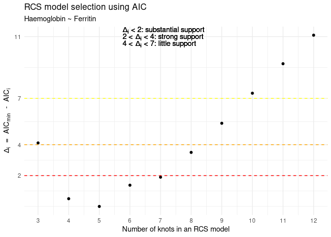
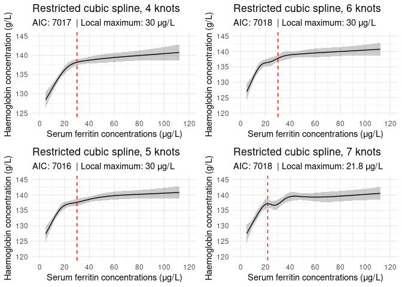
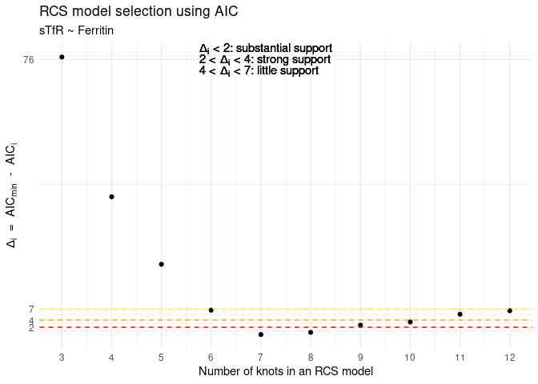
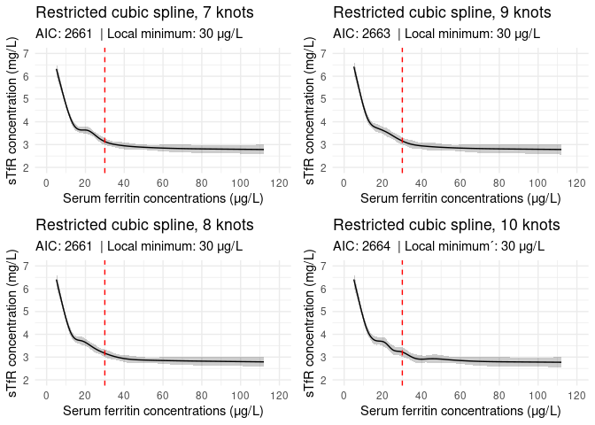
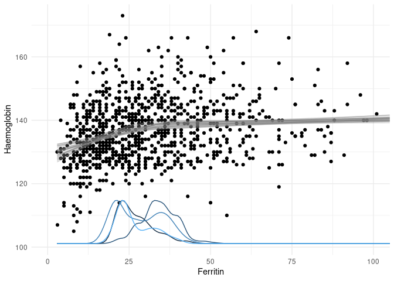
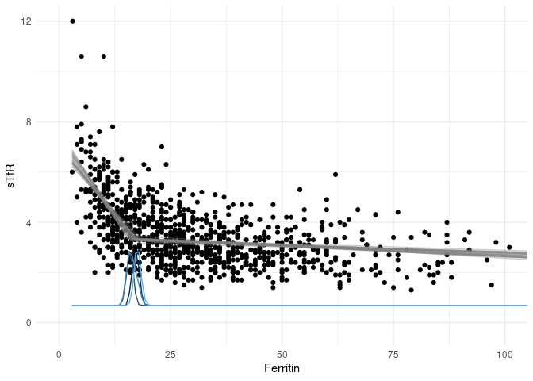
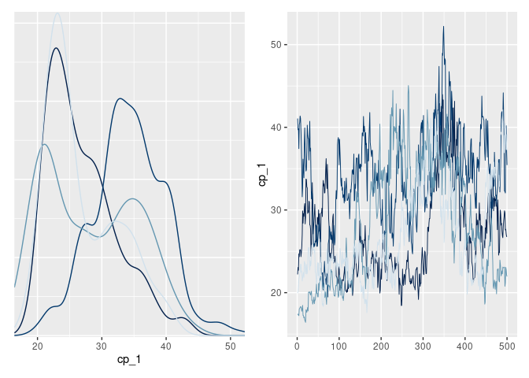
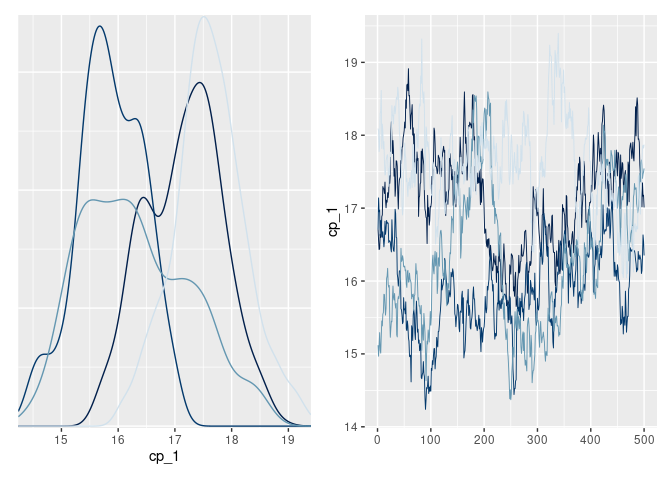

```r
library(tidyverse)
library(rms)
```

```
## Warning in .recacheSubclasses(def@className, def, env): undefined subclass
## "numericVector" of class "Mnumeric"; definition not updated
```

```r
library(mcp)
```


```r
# This Rmd assumes the following naming conventions, but you may refactor as you please:
# df: dataframe containing ferritin, haemoglobin, and sTfR values
# Ferritin: ferritin column name
# Haemoglobin: haemoglobin column name
# sTfR: soluble transferritin receptor column name

# data <- load("~/stuff.Rdata")
# 
# # Filter if necessary
# 
# # Select and rename
# df <- data %>%
#     select(YourFerritinColumnName, YourHbColumnName, YourStfrColumnName) %>%
#     rename(Ferritin = YourFerritinColumnName, Haemoglobin = YourHbColumnName, sTfR = YourStfrColumnName)

# Below for demo purposes
# Load data on individual donations
load("~/CRP_enrichment/data/r02.fd.bd.all.rdata") # outputs an object called "output" into the environment
donations <- output

# We only want to look at first donation event values from each donor
donors <- donations %>%
    group_by(donor) %>%
    filter(date == min(date)) %>%
    ungroup()

# Load FinDonor demographic data
load("~/CRP_enrichment/data/r02ds.donorData.rdata") # outputs an object called "output" into the environment
findonor <- output

# Combine the FinDonor datasets
FinDonor <- left_join(donors, findonor, by = "donor")

# Filter
df <- FinDonor %>%
    filter(age >= 20 & age <= 49) %>%
    filter(gender == "Women") %>%
    select(Hb, Ferritin, TransferrinR) %>% 
    rename(Haemoglobin = Hb, sTfR = TransferrinR)
```


# Restricted Cubic Splines (Mei & Addot et al. approach)

## Haemoglobin
### Fit RCS with varying number of knots


```r
hb3 <- ols(Haemoglobin ~ rcs(Ferritin, 3), 
           data = df, 
           x = TRUE, 
           y = TRUE)
hb4 <- ols(Haemoglobin ~ rcs(Ferritin, 4), 
           data = df, 
           x = TRUE, 
           y = TRUE)
hb5 <- ols(Haemoglobin ~ rcs(Ferritin, 5), 
           data = df, 
           x = TRUE, 
           y = TRUE)
hb6 <- ols(Haemoglobin ~ rcs(Ferritin, 6), 
           data = df, 
           x = TRUE, 
           y = TRUE)
hb7 <- ols(Haemoglobin ~ rcs(Ferritin, 7), 
           data = df, 
           x = TRUE, 
           y = TRUE)
hb8 <- ols(Haemoglobin ~ rcs(Ferritin, 8), 
           data = df, 
           x = TRUE, 
           y = TRUE)
hb9 <- ols(Haemoglobin ~ rcs(Ferritin, 9), 
           data = df, 
           x = TRUE, 
           y = TRUE)
hb10 <- ols(Haemoglobin ~ rcs(Ferritin, 10), 
            data = df, 
            x = TRUE, 
            y = TRUE)
hb11 <- ols(Haemoglobin ~ rcs(Ferritin, 11), 
            data = df, 
            x = TRUE, 
            y = TRUE)
hb12 <- ols(Haemoglobin ~ rcs(Ferritin, 12), 
            data = df, 
            x = TRUE, 
            y = TRUE)
```


```r
Hb_AIC <- c(AIC(hb3),
            AIC(hb4), 
            AIC(hb5), 
            AIC(hb6), 
            AIC(hb7), 
            AIC(hb8), 
            AIC(hb9), 
            AIC(hb10), 
            AIC(hb11), 
            AIC(hb12))

Hb_AIC_min <- min(Hb_AIC)

Hb_AIC_mindiff <- Hb_AIC - Hb_AIC_min

knots <- 3:12

hb_AIC_df <- data.frame(knots = knots,
                        AIC_delta = Hb_AIC_mindiff)

ggplot(data = hb_AIC_df, aes(x = knots, 
                             y = AIC_delta)) +
    geom_point() +
    geom_hline(yintercept = 2, 
               linetype = "dashed", 
               color = "red") +
    geom_hline(yintercept = 4, 
               linetype = "dashed", 
               color = "orange") +
    geom_hline(yintercept = 7, 
               linetype = "dashed", 
               color = "yellow") +
    labs(title = "RCS model selection using AIC",
         subtitle = "Haemoglobin ~ Ferritin",
         x = "Number of knots in an RCS model",
         y = bquote(Delta[i] ~ " = " ~ AIC[min] ~ " - " ~ AIC[i])) +
    scale_x_continuous(breaks = c(3, 4, 5, 6, 7, 8, 9, 10, 11, 12)) +
    scale_y_continuous(breaks = c(2, 4, 7, as.integer(max(Hb_AIC_mindiff)))) +
    annotate(geom = "text", 
             label = bquote(Delta[i] ~ "< 2: substantial support"), 
             x = -Inf,
             y = Inf,
             hjust = -1.2,
             vjust = 1) +
    annotate(geom = "text", 
             label = bquote("2 <" ~ Delta[i] ~ "< 4: strong support"), 
             x = -Inf,
             y = Inf,
             hjust = -1.22,
             vjust = 2) +
    annotate(geom = "text", 
             label = bquote("4 <" ~ Delta[i] ~ "< 7: little support"), 
             x = -Inf,
             y = Inf,
             hjust = -1.34,
             vjust = 3) +
    theme_minimal()
```




```r
# You may choose to plot, for example, all those model fits that have delta < 2.
FIT_OBJ1 <- hb4
FIT_OBJ2 <- hb5
FIT_OBJ3 <- hb6
FIT_OBJ4 <- hb7

hb_p1 <- ggplot(Predict(FIT_OBJ1)) + 
    scale_x_continuous(breaks = c(0, 20, 40, 60, 80, 100, 120), 
                       limits = c(0, 120)) +
    # The lines below draw the line for the plateau point if there is one, feel free to del and/or alter interval
    geom_vline(xintercept = optimize(Function(FIT_OBJ1), interval = c(5, 30), maximum = TRUE)$maximum, linetype = "dashed", color = "red") +
    theme_minimal() + 
    labs(title = paste("Restricted cubic spline,", length(FIT_OBJ1$coefficients), "knots"),
         subtitle = paste("AIC:", as.integer(AIC(FIT_OBJ1)), 
                          " | Local maximum:", 
                          round(optimize(Function(FIT_OBJ1), interval = c(5, 30), maximum = TRUE)$maximum, 1),
                          "μg/L"),
         x = "Serum ferritin concentrations (μg/L)",
         y = "Haemoglobin concentration (g/L)")

hb_p2 <- ggplot(Predict(FIT_OBJ2)) + 
    scale_x_continuous(breaks = c(0, 20, 40, 60, 80, 100, 120), 
                       limits = c(0, 120)) +
    # The lines below draw the line for the plateau point if there is one, feel free to del and/or alter interval
    geom_vline(xintercept = optimize(Function(FIT_OBJ2), interval = c(5, 30), maximum = TRUE)$maximum, linetype = "dashed", color = "red") +
    theme_minimal() + 
    labs(title = paste("Restricted cubic spline,", length(FIT_OBJ2$coefficients), "knots"),
         subtitle = paste("AIC:", as.integer(AIC(FIT_OBJ2)), 
                          " | Local maximum:", 
                          round(optimize(Function(FIT_OBJ2), interval = c(5, 30), maximum = TRUE)$maximum, 1),
                          "μg/L"),
         x = "Serum ferritin concentrations (μg/L)",
         y = "Haemoglobin concentration (g/L)")

hb_p3 <- ggplot(Predict(FIT_OBJ3)) + 
    scale_x_continuous(breaks = c(0, 20, 40, 60, 80, 100, 120), 
                       limits = c(0, 120)) +
    # The lines below draw the line for the plateau point if there is one, feel free to del and/or alter interval
    geom_vline(xintercept = optimize(Function(FIT_OBJ3), interval = c(5, 30), maximum = TRUE)$maximum, linetype = "dashed", color = "red") +
    theme_minimal() + 
    labs(title = paste("Restricted cubic spline,", length(FIT_OBJ3$coefficients), "knots"),
         subtitle = paste("AIC:", as.integer(AIC(FIT_OBJ3)), 
                          " | Local maximum:", 
                          round(optimize(Function(FIT_OBJ3), interval = c(5, 30), maximum = TRUE)$maximum, 1),
                          "μg/L"),
         x = "Serum ferritin concentrations (μg/L)",
         y = "Haemoglobin concentration (g/L)")

hb_p4 <- ggplot(Predict(FIT_OBJ4)) + 
    scale_x_continuous(breaks = c(0, 20, 40, 60, 80, 100, 120), 
                       limits = c(0, 120)) +
    # The lines below draw the line for the plateau point if there is one, feel free to del and/or alter interval
    geom_vline(xintercept = optimize(Function(FIT_OBJ4), interval = c(5, 30), maximum = TRUE)$maximum, linetype = "dashed", color = "red") +
    theme_minimal() + 
    labs(title = paste("Restricted cubic spline,", length(FIT_OBJ4$coefficients), "knots"),
         subtitle = paste("AIC:", as.integer(AIC(FIT_OBJ4)), 
                          " | Local maximum:", 
                          round(optimize(Function(FIT_OBJ4), interval = c(5, 30), maximum = TRUE)$maximum, 1),
                          "μg/L"),
         x = "Serum ferritin concentrations (μg/L)",
         y = "Haemoglobin concentration (g/L)")

multiplot(hb_p1, hb_p2, hb_p3, hb_p4, cols = 2)
```



## sTfR
### Fit RCS with varying number of knots


```r
stfr3 <- ols(sTfR ~ rcs(Ferritin, 3), 
           data = df, 
           x = TRUE, 
           y = TRUE)
stfr4 <- ols(sTfR ~ rcs(Ferritin, 4), 
           data = df, 
           x = TRUE, 
           y = TRUE)
stfr5 <- ols(sTfR ~ rcs(Ferritin, 5), 
           data = df, 
           x = TRUE, 
           y = TRUE)
stfr6 <- ols(sTfR ~ rcs(Ferritin, 6), 
           data = df, 
           x = TRUE, 
           y = TRUE)
stfr7 <- ols(sTfR ~ rcs(Ferritin, 7), 
           data = df, 
           x = TRUE, 
           y = TRUE)
stfr8 <- ols(sTfR ~ rcs(Ferritin, 8), 
           data = df, 
           x = TRUE, 
           y = TRUE)
stfr9 <- ols(sTfR ~ rcs(Ferritin, 9), 
           data = df, 
           x = TRUE, 
           y = TRUE)
stfr10 <- ols(sTfR ~ rcs(Ferritin, 10), 
            data = df, 
            x = TRUE, 
            y = TRUE)
stfr11 <- ols(sTfR ~ rcs(Ferritin, 11), 
            data = df, 
            x = TRUE, 
            y = TRUE)
stfr12 <- ols(sTfR ~ rcs(Ferritin, 12), 
            data = df, 
            x = TRUE, 
            y = TRUE)
```


```r
stfr_AIC <- c(AIC(stfr3),
              AIC(stfr4), 
              AIC(stfr5), 
              AIC(stfr6), 
              AIC(stfr7), 
              AIC(stfr8), 
              AIC(stfr9), 
              AIC(stfr10), 
              AIC(stfr11), 
              AIC(stfr12))

stfr_AIC_min <- min(stfr_AIC)

stfr_AIC_mindiff <- stfr_AIC - stfr_AIC_min

knots <- 3:12

stfr_AIC_df <- data.frame(knots = knots,
                          AIC_delta = stfr_AIC_mindiff)

ggplot(data = stfr_AIC_df, aes(x = knots,
                               y = AIC_delta)) +
    geom_point() +
    geom_hline(yintercept = 2, 
               linetype = "dashed", 
               color = "red") +
    geom_hline(yintercept = 4, 
               linetype = "dashed", 
               color = "orange") +
    geom_hline(yintercept = 7, 
               linetype = "dashed", 
               color = "yellow") +
    labs(title = "RCS model selection using AIC",
         subtitle = "sTfR ~ Ferritin",
         x = "Number of knots in an RCS model",
         y = bquote(Delta[i] ~ " = " ~ AIC[min] ~ " - " ~ AIC[i])) +
    scale_x_continuous(breaks = c(3, 4, 5, 6, 7, 8, 9, 10, 11, 12)) +
    scale_y_continuous(breaks = c(2, 4, 7, as.integer(max(stfr_AIC_mindiff)))) +
    annotate(geom = "text",
             label = bquote(Delta[i] ~ "< 2: substantial support"),
             x = -Inf,
             y = Inf,
             hjust = -1.2,
             vjust = 1) +
    annotate(geom = "text",
             label = bquote("2 <" ~ Delta[i] ~ "< 4: strong support"),
             x = -Inf,
             y = Inf,
             hjust = -1.22,
             vjust = 2) +
    annotate(geom = "text",
             label = bquote("4 <" ~ Delta[i] ~ "< 7: little support"),
             x = -Inf,
             y = Inf,
             hjust = -1.34,
             vjust = 3) +
    theme_minimal()
```




```r
# You may choose to plot, for example, all those model fits that have delta < 2.
FIT_OBJ1 <- stfr7
FIT_OBJ2 <- stfr8
FIT_OBJ3 <- stfr9
FIT_OBJ4 <- stfr10

stfr_p1 <- ggplot(Predict(FIT_OBJ1)) + 
    scale_x_continuous(breaks = c(0, 20, 40, 60, 80, 100, 120), 
                       limits = c(0, 120)) +
    # The lines below draw the line for the plateau point if there is one, feel free to del and/or alter interval
    geom_vline(xintercept = optimize(Function(FIT_OBJ1), interval = c(5, 30), maximum = FALSE)$minimum, linetype = "dashed", color = "red") +
    theme_minimal() + 
    labs(title = paste("Restricted cubic spline,", length(FIT_OBJ1$coefficients), "knots"),
         subtitle = paste("AIC:", as.integer(AIC(FIT_OBJ1)), 
                          " | Local minimum:", 
                          round(optimize(Function(FIT_OBJ1), interval = c(5, 30), maximum = FALSE)$minimum, 1),
                          "μg/L"),
         x = "Serum ferritin concentrations (μg/L)",
         y = "sTfR concentration (mg/L)")

stfr_p2 <- ggplot(Predict(FIT_OBJ2)) + 
    scale_x_continuous(breaks = c(0, 20, 40, 60, 80, 100, 120), 
                       limits = c(0, 120)) +
    # The lines below draw the line for the plateau point if there is one, feel free to del and/or alter interval
    geom_vline(xintercept = optimize(Function(FIT_OBJ2), interval = c(5, 30), maximum = FALSE)$minimum, linetype = "dashed", color = "red") +
    theme_minimal() + 
    labs(title = paste("Restricted cubic spline,", length(FIT_OBJ2$coefficients), "knots"),
         subtitle = paste("AIC:", as.integer(AIC(FIT_OBJ2)), 
                          " | Local minimum:", 
                          round(optimize(Function(FIT_OBJ2), interval = c(5, 30), maximum = FALSE)$minimum, 1),
                          "μg/L"),
         x = "Serum ferritin concentrations (μg/L)",
         y = "sTfR concentration (mg/L)")

stfr_p3 <- ggplot(Predict(FIT_OBJ3)) + 
    scale_x_continuous(breaks = c(0, 20, 40, 60, 80, 100, 120), 
                       limits = c(0, 120)) +
    # The lines below draw the line for the plateau point if there is one, feel free to del and/or alter interval
    geom_vline(xintercept = optimize(Function(FIT_OBJ3), interval = c(5, 30), maximum = FALSE)$minimum, linetype = "dashed", color = "red") +
    theme_minimal() + 
    labs(title = paste("Restricted cubic spline,", length(FIT_OBJ3$coefficients), "knots"),
         subtitle = paste("AIC:", as.integer(AIC(FIT_OBJ3)), 
                          " | Local minimum:", 
                          round(optimize(Function(FIT_OBJ3), interval = c(5, 30), maximum = FALSE)$minimum, 1),
                          "μg/L"),
         x = "Serum ferritin concentrations (μg/L)",
         y = "sTfR concentration (mg/L)")

stfr_p4 <- ggplot(Predict(FIT_OBJ4)) + 
    scale_x_continuous(breaks = c(0, 20, 40, 60, 80, 100, 120), 
                       limits = c(0, 120)) +
    # The lines below draw the line for the plateau point if there is one, feel free to del and/or alter interval
    geom_vline(xintercept = optimize(Function(FIT_OBJ4), interval = c(5, 30), maximum = FALSE)$minimum, linetype = "dashed", color = "red") +
    theme_minimal() + 
    labs(title = paste("Restricted cubic spline,", length(FIT_OBJ4$coefficients), "knots"),
         subtitle = paste("AIC:", as.integer(AIC(FIT_OBJ4)), 
                          " | Local minimum´:", 
                          round(optimize(Function(FIT_OBJ4), interval = c(5, 30), maximum = FALSE)$minimum, 1),
                          "μg/L"),
         x = "Serum ferritin concentrations (μg/L)",
         y = "sTfR concentration (mg/L)")

multiplot(stfr_p1, stfr_p2, stfr_p3, stfr_p4, cols = 2)
```




# Breakpoint analysis

Let's use piecewise linear regression to estimate a breakpoint. This takes a while depending on the number of iterations you wish to use (raising the number may help chains to converge).


```r
# Specify model
model_spec_haem <- list(Haemoglobin ~ Ferritin,
                   ~ 0 + Ferritin)
model_spec_stfr <- list(sTfR ~ Ferritin,
                   ~ 0 + Ferritin)

# Fit
mcp_fit_haem <- mcp(model_spec_haem, 
               data = na.omit(df),
               adapt = 3000,
               iter = 500,
               chains = 4,
               cores = 4)
```

```
## Parallel sampling in progress...
```

```
## Warning: Strategy 'multiprocess' is deprecated in future (>= 1.20.0). Instead,
## explicitly specify either 'multisession' or 'multicore'. In the current R
## session, 'multiprocess' equals 'multisession'.
```

```
## Warning in supportsMulticoreAndRStudio(...): [ONE-TIME WARNING] Forked
## processing ('multicore') is not supported when running R from RStudio
## because it is considered unstable. For more details, how to control forked
## processing or not, and how to silence this warning in future R sessions, see ?
## parallelly::supportsMulticore
```

```
## Finished sampling in 18.2 seconds
```

```r
mcp_fit_stfr <- mcp(model_spec_stfr, 
               data = na.omit(df),
               adapt = 3000,
               iter = 500,
               chains = 4,
               cores = 4)
```

```
## Parallel sampling in progress...
```

```
## Finished sampling in 12.5 seconds
```


```r
summary(mcp_fit_haem)
```

```
## Family: gaussian(link = 'identity')
## Iterations: 2000 from 4 chains.
## Segments:
##   1: Haemoglobin ~ Ferritin
##   2: Haemoglobin ~ 1 ~ 0 + Ferritin
## 
## Population-level parameters:
##        name    mean    lower   upper Rhat n.eff
##        cp_1  29.060  19.0489  41.369  1.2    20
##  Ferritin_1   0.381   0.1618   0.620  1.1   314
##  Ferritin_2   0.023  -0.0054   0.055  1.2    43
##       int_1 128.196 124.6510 132.008  1.2    34
##     sigma_1   9.360   8.9485   9.766  1.0  1238
```

```r
summary(mcp_fit_stfr)
```

```
## Family: gaussian(link = 'identity')
## Iterations: 2000 from 4 chains.
## Segments:
##   1: sTfR ~ Ferritin
##   2: sTfR ~ 1 ~ 0 + Ferritin
## 
## Population-level parameters:
##        name    mean   lower  upper Rhat n.eff
##        cp_1 16.7317 14.9562 18.540  2.1    16
##  Ferritin_1 -0.2331 -0.2860 -0.189  1.0   391
##  Ferritin_2 -0.0069 -0.0098 -0.004  1.7    56
##       int_1  7.1865  6.6566  7.718  2.1    25
##     sigma_1  0.9878  0.9455  1.036  1.0  1219
```


```r
plot(mcp_fit_haem) +
    theme_minimal() +
    coord_cartesian(xlim = c(0, 100)) 
```

<!-- -->

```r
plot(mcp_fit_stfr) +
    theme_minimal() +
    coord_cartesian(xlim = c(0, 100)) 
```

<!-- -->


```r
plot_pars(mcp_fit_haem, regex_pars = "cp_")
```



```r
plot_pars(mcp_fit_stfr, regex_pars = "cp_")
```


